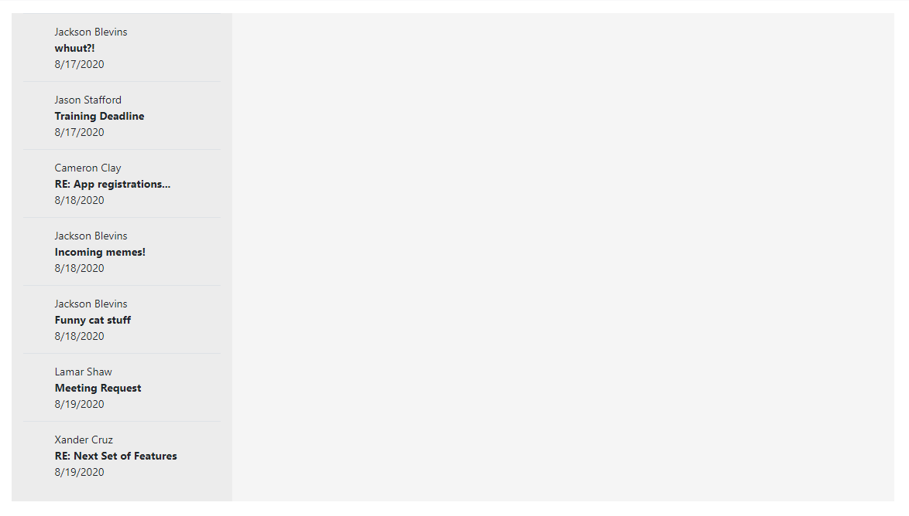
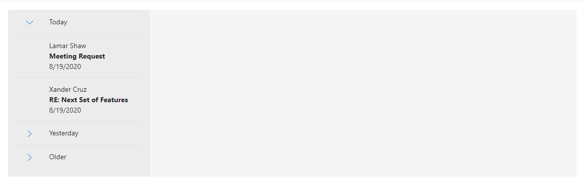
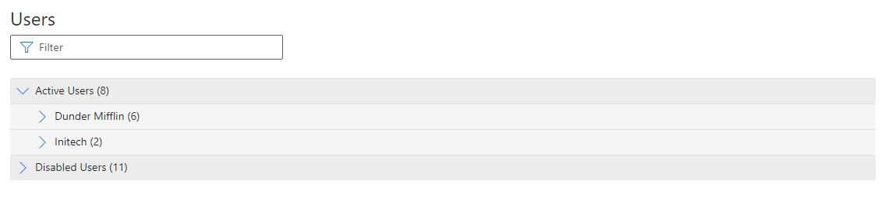
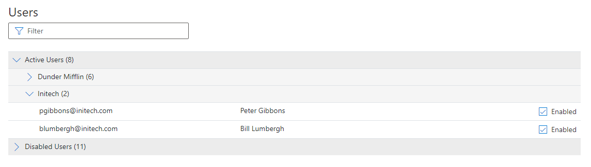

# Fable.GroupingPanel
The `groupingPanel` is a computation expression that helps you to easily group UI data in Fable into one or more collapsible groups.

## Installation
Get it from NuGet!

[](https://www.nuget.org/packages/Fable.GroupingPanel/)


## Message Inbox Example

Imagine you are creating a messaging app that lists messages in the left pane.  
You might start out with this:

```F#
let page = React.functionComponent(fun () -> 
    container [
        div [Class "row"] [
            div [Class "col-3"; Style [Background "#ececec"]] [
                table [Class B.table] [
                    tbody [] [
                        for email in getEmails() do
                            tr [] [
                                td [] []
                                td [] [
                                    div [] [str email.From]
                                    div [Style [FontWeight "bold"]] [str email.Subject]
                                    div [] [str (email.Received.ToShortDateString())]
                                ]
                            ]
                    ]
                ]
            ]
            div [Class "col-9 p-2"; Style [Background "whitesmoke"]] [
                // Display message here...
            ]
        ]        
    ]
)
```   
Which yields:


Now let's add some collapsable groups using the `groupingPanel` computation expression:
```F#
let page = React.functionComponent(fun () ->     
    container [
        div [Class "row"] [
            div [Class "col-3"; Style [Background "#ececec"]] [
                table [Class B.table] [
                    tbody [] [
                        groupingPanel {
                            for email in getEmails() do
                            groupBy (
                                match email.Received with
                                | r when r = today  -> "Today"
                                | r when r >= (day -1) -> "Yesterday"
                                | _ -> "Older"
                            )
                            groupSortByDescending (email.Received)
                            groupHeader (fun header ->
                                tr [] [
                                    td [Style [Width "10px"]] [header.Chevron]
                                    td [] [str header.GroupKey]
                                ]
                            )
                            groupCollapsedIf (email.Received < today)
                            select (
                                tr [] [
                                    td [] []
                                    td [] [
                                        div [] [str email.From]
                                        div [Style [FontWeight "bold"]] [str email.Subject]
                                        div [] [str (email.Received.ToShortDateString())]
                                    ]
                                ]
                            )
                        }
                    ]
                ]
            ]
            div [Class "col-9 p-2"; Style [Background "whitesmoke"]] [
                b [] [str "Message Body..."]
            ]
        ]        
    ]
)
```

Which yields:


## Users List Example
This example uses two levels of grouping. 

**Note that the "grouping modifiers" that are prefixed with `group` (like `groupCollapsedIf`) must be preceded by a `groupBy`.**

```F#
row [
    col [
        table [Class "table mt-4"] [
            tbody [] [
                let headerTemplate header = 
                    tr [Style [Background "#ececec"]; OnClick header.ToggleOnClick] [
                        td [ColSpan 4] [
                            header.Chevron
                            span [] [str (sprintf "%s (%i)" header.GroupKey header.Group.Length)]
                        ]                                    
                    ]
                    
                groupingPanel {
                    for user in filteredUsers() do
                    groupBy (if user.IsEnabled then "Active Users" else "Disabled Users")
                    groupHeader headerTemplate
                    groupCollapsedIf (not user.IsEnabled)
                    groupBy (getCompany user.Email)
                    groupHeader headerTemplate
                    select (
                        tr [Key ("usr_" + user.Email)] [
                            td [] []
                            td[Style[LineHeight "30px"]] [
                                str user.Email
                            ]
                            td [] [
                                str user.Username
                            ]
                            td [] [
                                input [
                                    Props.Type "checkbox"
                                    Style [Width "20px"; Height "32px"]
                                    Class B.``form-control`` 
                                    DefaultChecked (user.IsEnabled)
                                ]
                            ]
                        ]
                    )
                } 
            ]
        ]
    ]
]
```
Note that the first group, "Active Users", is initially expanded based on the `groupCollapsedIf` option:

`groupCollapsedIf (not user.IsEnabled)`





## Minimum Configuration
Operation | Description | Required
--------- | ----------- | --------
`for` ___ `in` ___ `do` | Initializes the items | Yes
`groupBy` | This adds a grouping | Yes (one or more)
`select` | This defines the item template | Yes

## Full List of Configuration Options
Operation | Description | Required
--------- | ----------- | --------
`for` ___ `in` ___ `do` | Initializes the items | Yes
`localStorageKey` | Persists your collapsed state in local storage if a key is specified | No
`groupBy` | This adds a grouping | Yes (one or more)
`groupHeader` | Allows the user to specify a group header template | No
`groupFooter` | Allows the user to specify a group footer template | No
`groupCollapsed` | A bool that will determine whether the group will be collapsed by default | No
`groupCollapsedIf` | An expression based on the `for` item that will determine whether a group will be collapsed | No
`groupSortBy` | An expression based on the `for` item that will sort a group in ascending order | No
`groupSortByDescending` | An expression based on the `for` item that will sort a group in descending order | No
`groupColor` | Overrides the bg color - only applies when using the default group header template | No
`select` | This defines the item template | Yes
